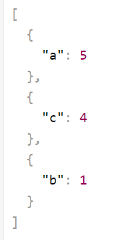

## Requirements
* JDK 17
* Apache Maven 3.6.3
  
## Installation
Clone repository form GitHub.
```shell
git clone https://github.com/1aazy/t1_task.git
```

## Functionality
REST API that calculates the frequency of occurrence of characters in a given string.

```shell
http://localhost:8080
```
View:</br>


## Input values
You can input any symbols (a-z, A-z) include "`~!@#$%^&*()?.,;:№".</br>
All white spaces would be truncated.</br></br>
If you enter an empty string you will get an error:</br>


## Example
1. Input correct string:</br>
   
2. Receive correct answer:</br>
   

